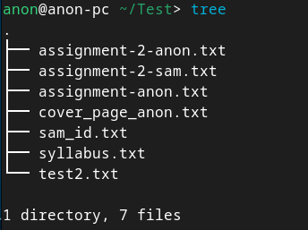
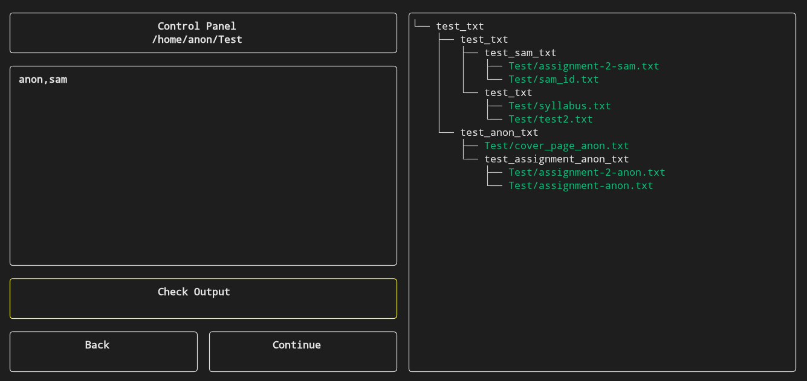
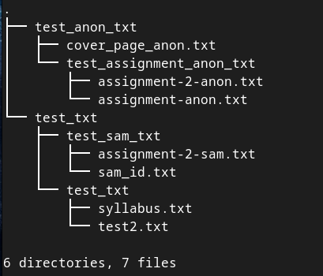

# SmartFileMapper

A simple C program that maps (reorganizes) files from the given source directory.
It uses Hierarchical Clustering to group files based on their name similarity and then moves them into corresponding subdirectories in the destination directory.
The name similarity is calculated using Jaccard Index.
(this project is made for educational purposes, so it currently may not be well suitable for real life use yet)


before :


process:


after :


build and run:
```
cd build
cmake . && make && ./SmartFileMapper
```